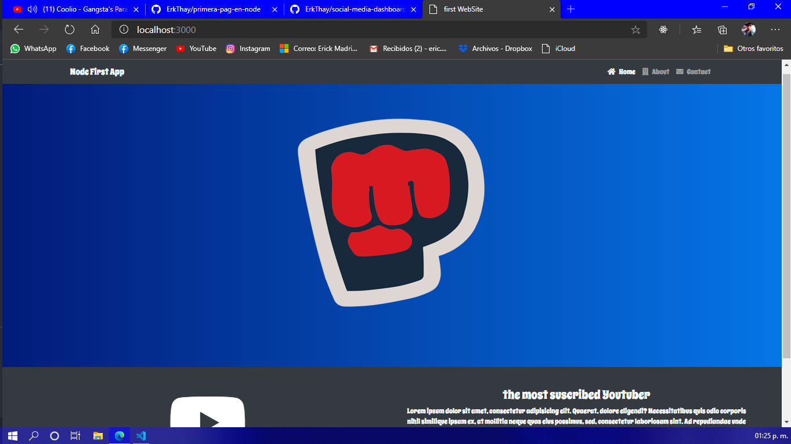
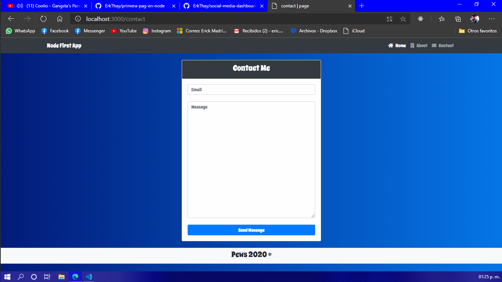

# Mi primera pagina en NodeJs

## interfaz

## package.json (descripcion de nuestro proyecto)

* iniciar el proyecto primero con git y despues con npm (npm init --yes y se creara el pakage.json)  
 
"name": "primera-pag-en-node",  //nombre del proyecto  
  "version": "1.0.0",           //vercion semantica de identificacion del proyecto  
  "description": "",            //descripcion de busqueda de npm de nuestro proyecto  
  "main": "index.js",           //archivo principal de todo el proyecto  
  "scripts": {                  //comandos propios o comando star de arranque  
    "start": "node src",        //el comando lo lee Node despues de escribir (npm start) 
        //el comando lo lee Node despues de escribir (npm run dev) (nodemon) lo que hace es que se reinicia el servidor una ves modificado el codigo  
    "dev": "nodemon src"  
  },  
  "keywords": [],  
  "author": "",  
  "license": "ISC",  
  "dependencies": {  // modulos que necesita mi programa  
    "ejs": "^3.1.3",  
    "express": "^4.17.1",  
    "morgan": "^1.10.0"  
  },  
  "devDependencies": { // nodulos que no necesitan mi programa  
    "nodemon": "^2.0.4"  
  }              

  ## modulos de npm 

  * Express  (framework del servidor)
  * EJS       (motor de plantillas)
  * Morgan     (lista en consola de lo que piden los usrs)
  * NodeMond    (npm i nodemond -D  dependencia de desarrollo)
  * bootstrap v5.4

  ## al ejecutarse en otra PC se testea el comando 
  
  * npm install
